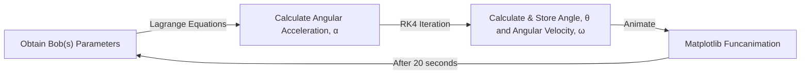

# Double Pendulum Simulation

The following is a Double Pendulum Simulation made using `Python` and `Ttkbootstrap`. This GUI application allows users to investigate the real-time motion of a double pendulum, while also being able to modify the pendulum's parameters such as the bob(s) mass $m_i$, length of string(s) $\ell_i$, intial displacement(s) $\theta_i$ and initial angular velocities $\omega_i$.

https://github.com/user-attachments/assets/838bea28-6822-4cd8-afa5-fa7aab3102c0

## 🛠️ Introduction

This simulation was created while I was taking Mechanics II course because i wanted a better understanding of the Lagrange Equations. The following the general flow chart of what is happening within the application.

Of course, I did not include a flowchart of `Ttkbootstrap` API as it is quite complex (I should do this when planning out future applications). For more information regarding the theory, please refer to the file [/legacy/double-pendulum.ipynb](./legacy/double-pendulum.ipynb).

## 🚀 Setting-Up Environment

In order to run this application using `Python`, perform the following steps after cloning the environment :

1. Open terminal, and change to project directory — `cd double-pendulum`.
2. Create new environment with installed dependencies — `conda env create -f environment.yml`.
3. Activate the environment — `conda activate double-p`.
4. Change to app directory — `cd app`.
5. Use python to run the file — `python double-pendulum.py`.

## 📦 Packaging into Executable

Packaging the simulation into a single executable file has been tested for both Linux and Windows, peform the following :

1. While in `double-p` environment, change to app directory — `cd app`.
2. Package the `py` file alongside it's dependencies  — `pyinstaller double-pendulum.spec`.

Users are also welcome to customize the output application's settings by editing the `spec` file.

## ⚠️ Known Issues

The following are some known issues within the application :

1. Resizing the window while simulation is running causes the visualisation to become buggy.
2. Rescaling on low resolution computers (namely, monitors with low vertical height) squeezes the application somewhat tightly.

I make no promises to fix these issues in the future.

## 📄 License
[MIT License](LICENSE)
